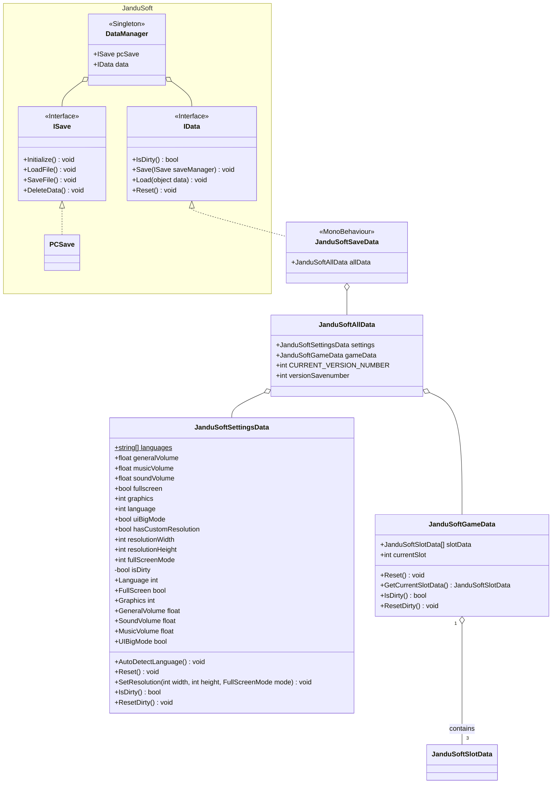

# SaveManager

Este documento explica como funciona el sistema de guardado de **Farlands** y como lo modifica **FarlandsCoreMod**

## Analisis

Primero vamos a estudiar el funcionamiento de **Farlands** y para ello primero vamos a mostrar un diagrama con las principales clases implicadas

`DataManager` es quien controla la carga de datos en **Farlands** y podemos observar que tiene dos interfaces principales `ISave` y `IData`.
`ISave` es la encargada de guardar los datos, mientras que `IData` parece ser la estructura de los datos en sí.
