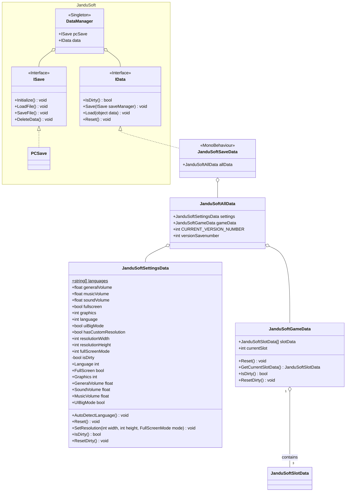

# SaveManager

This document explains how **Farlands**' save system works and how **FarlandsCoreMod** modifies it.

## Analysis

First, we will analyze the inner workings of **Farlands** by examining a class diagram of the main involved components:

`DataManager` controls data loading and storing in **Farlands**, featuring two primary interfaces: `ISave` and `IData`. `ISave` is responsible for saving the data, whereas `IData` represents the data structure itself.

### Settings
Although there is a `JanduSoftSettingsData` it's not used for some cases.
- `Language`: `PlayerPrefs("Language")` in functions 
    - `PixelCrushers.UILocationManager.Initialize()`
    - `PixelCrushers.UILocationManager.UpdateUIs(...)`
- `Audio`: This is using the `JanduSoftSettingsData`

## Mods

### Alternative SaveFile

To prevent issues with the original game save file, its save location has been changed.
By default, the original location is `C:\users\USERNAME\AppData\LocalLow\JanduSoft\Farlands\gamedata.dat`, the modified location is `C:\users\USERNAME\AppData\LocalLow\JanduSoft\Farlands\gamedata.fcm.dat`
